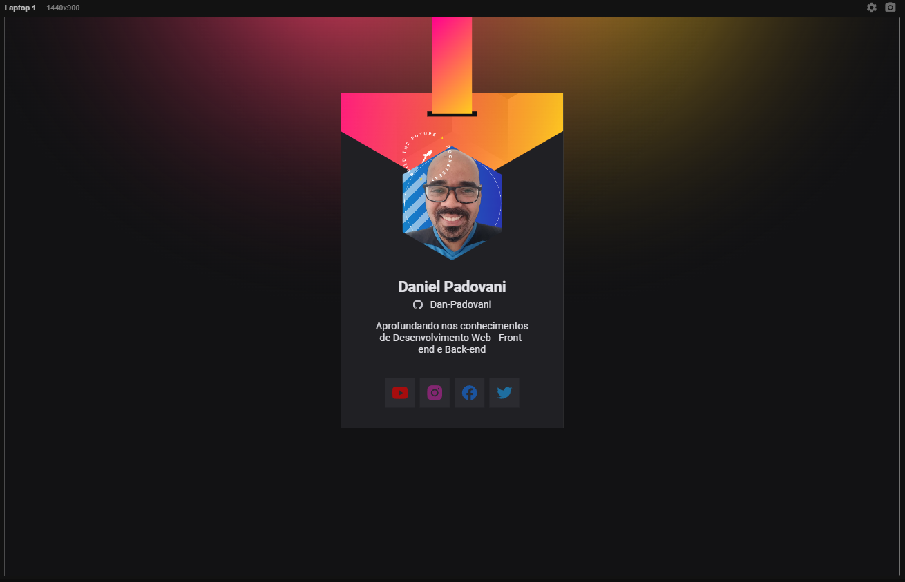
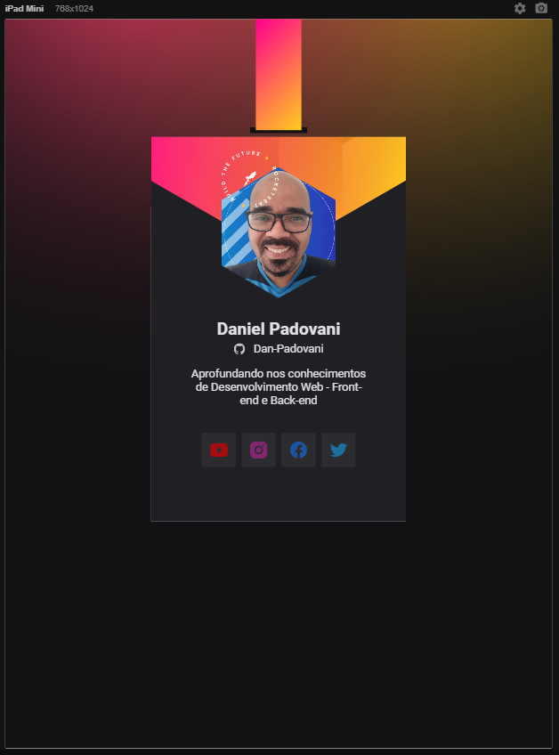
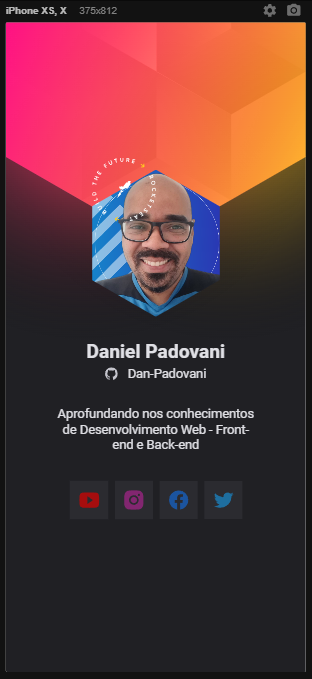

# NLW Heat - Mission Origin

## NLW Week 18 a 24 de outubro - Mission Origin

Project developed and inspired in DoWhile 2021 event - By Rocketseat 

---

### About

In this project we developed a identification card consuming the github API.

As a challenge we did the desktop version.

---

### Desktop

	

### Tablet and Mobile

	
	

---

### How To Use

Just access the link bellow:

<a href="https://dan-padovani.github.io/NLW-Heat-Origin/" target="_blank">NLW Heat acesse aqui</a>

---

### :rocket: Technologies

---

### :dart: Author

	Made with &#128150 by Daniel Padovani &#128075 Entre em contato! 	

    

---

### :memo: License

This project is under the MIT license. See the [LICENSE](LICENSE) for more information.
